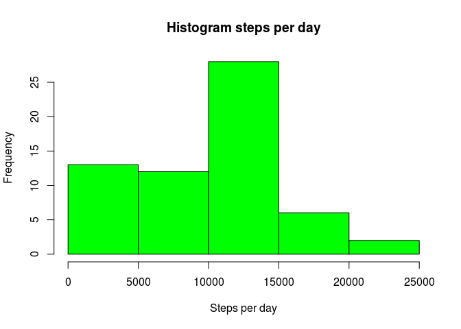
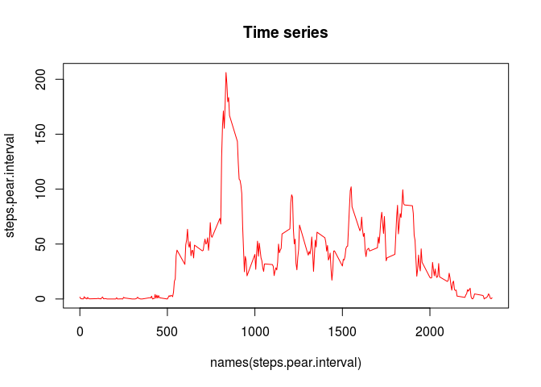
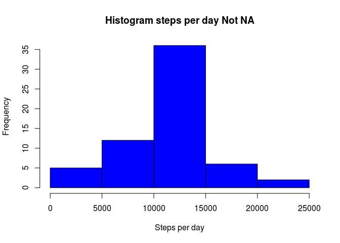
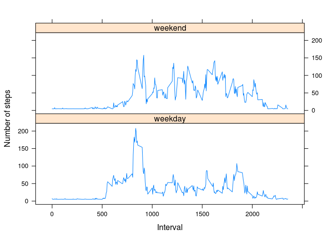

# Reproducible Research: Peer Assessment 1

## Loading and preprocessing the data
Down load the file. Uncompress and convert date to POSIX format.

```r
download.file("https://d396qusza40orc.cloudfront.net/repdata%2Fdata%2Factivity.zip", "data-activity.zip")
unzip("data-activity.zip", exdir = "DATA")
activity <- read.csv("./DATA/activity.csv", header = TRUE)
activity$date <- as.Date(as.character(activity$date), "%Y-%m-%d")
```
## What is mean total number of steps taken per day?
Generate the histogram. Print the table with steps per days. And print the mean and meadian per day without missing values.

```r
steps.pear.day <- tapply(activity$steps, activity$date, FUN = sum, na.rm = TRUE)
hist(steps.pear.day, main = "Histogram steps per day", xlab = "Steps per day", col = "green")
```

<!-- -->

```r
mean.perday <- mean(steps.pear.day, na.rm = TRUE)
median.perday <- median(steps.pear.day, na.rm = TRUE)
steps.pear.day
```

```
## 2012-10-01 2012-10-02 2012-10-03 2012-10-04 2012-10-05 2012-10-06 
##          0        126      11352      12116      13294      15420 
## 2012-10-07 2012-10-08 2012-10-09 2012-10-10 2012-10-11 2012-10-12 
##      11015          0      12811       9900      10304      17382 
## 2012-10-13 2012-10-14 2012-10-15 2012-10-16 2012-10-17 2012-10-18 
##      12426      15098      10139      15084      13452      10056 
## 2012-10-19 2012-10-20 2012-10-21 2012-10-22 2012-10-23 2012-10-24 
##      11829      10395       8821      13460       8918       8355 
## 2012-10-25 2012-10-26 2012-10-27 2012-10-28 2012-10-29 2012-10-30 
##       2492       6778      10119      11458       5018       9819 
## 2012-10-31 2012-11-01 2012-11-02 2012-11-03 2012-11-04 2012-11-05 
##      15414          0      10600      10571          0      10439 
## 2012-11-06 2012-11-07 2012-11-08 2012-11-09 2012-11-10 2012-11-11 
##       8334      12883       3219          0          0      12608 
## 2012-11-12 2012-11-13 2012-11-14 2012-11-15 2012-11-16 2012-11-17 
##      10765       7336          0         41       5441      14339 
## 2012-11-18 2012-11-19 2012-11-20 2012-11-21 2012-11-22 2012-11-23 
##      15110       8841       4472      12787      20427      21194 
## 2012-11-24 2012-11-25 2012-11-26 2012-11-27 2012-11-28 2012-11-29 
##      14478      11834      11162      13646      10183       7047 
## 2012-11-30 
##          0
```

```r
mean.perday
```

```
## [1] 9354.23
```

```r
median.perday
```

```
## [1] 10395
```
## What is the average daily activity pattern?
Generate the plot for daily activity pattern and print the inteval with highest value.

```r
steps.pear.interval <- tapply(activity$steps, activity$interval, FUN = mean, na.rm = TRUE)
plot(names(steps.pear.interval), steps.pear.interval, type = "l", col = "red", main = "Time series")
```

<!-- -->

```r
sort(steps.pear.interval, decreasing = TRUE)[1]
```

```
##      835 
## 206.1698
```
## Imputing missing values
Replace al NAs with the steps mean. Generate the histogram and print the mean and median

```r
sum(is.na(activity[,1:dim(activity)[2]]))
```

```
## [1] 2304
```

```r
activity.notna <- activity
activity.notna$steps[is.na(activity.notna$steps)] <- mean(activity.notna$steps, na.rm = TRUE)
steps.pear.day.notna <- tapply(activity.notna$steps, activity.notna$date, FUN = sum, na.rm = TRUE)
hist(steps.pear.day.notna, main = "Histogram steps per day Not NA", xlab = "Steps per day", col = "blue")
```

<!-- -->

```r
mean(steps.pear.day.notna, na.rm = TRUE)
```

```
## [1] 10766.19
```

```r
median(steps.pear.day.notna, na.rm = TRUE)
```

```
## [1] 10766.19
```
## Are there differences in activity patterns between weekdays and weekends?
Make the activity pattern for weekdays and weekends. It seems that there are differences. More activity in upper intervals.
IMPORTANT: I have my system in spanish, i had to use 'sábado' as 'saturday' and 'domingo' as 'sunday'

```r
activity.notna$day <- ifelse(weekdays(activity.notna$date) %in% c("sábado", "domingo"), "weekend", "weekday")
steps.pear.interval.notna <- aggregate(activity.notna$steps, list(activity.notna$interval, activity.notna$day), FUN = mean, na.rm = TRUE)
library(lattice)
xyplot(x ~ Group.1 | Group.2, data = steps.pear.interval.notna, layout = c(1,2), type = "l", xlab = "Interval", ylab = "Number of steps")
```

<!-- -->
